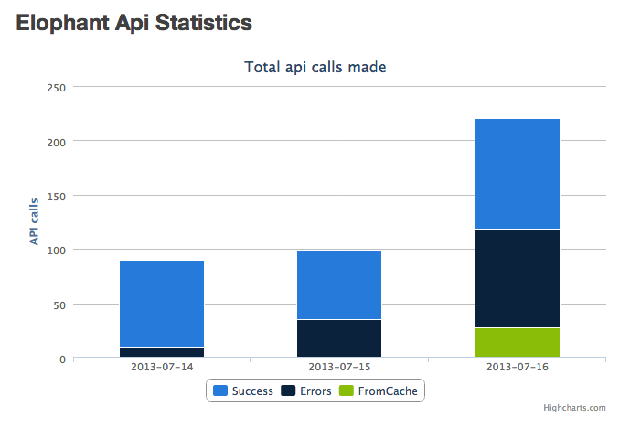

Features
========

This bundle allows to easily use the Elophant API in your Symfony2
project by configuring it through your configuration.

- **Visualization** - See how much request has succeded / failed per day (requires SonataAdminBundle / Optionnal)
- **Cache implementation** - Avoid reaching the global API request exceeded by caching the API response

Documentation
============

For documentation, see:

[`Resources/doc/index.rst`](https://github.com/tristanbes/ElophantBundle/blob/master/Resources/doc/index.rst)

License
============

[`Resources/meta/LICENSE`](https://github.com/tristanbes/ElophantBundle/blob/master/Resources/meta/LICENSE)

